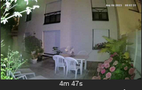

# lxrootard Jeedom v4 Widgets

## Image Viewer

Widget to display an image from an URL command
 
[Get the code](./dashboard/cmd.info.string.ImageViewer_lxr.html)

## Installation
Copy the html code in `/var/www/html/data/customTemplates/{type}` 
 Copy the pictures (if any) in  `/var/www/html/data/customTemplates/{type}/{widget_name}`
 Where `{type}` = dashboard or mobile and `{widget_name}` is the widget's html name 
