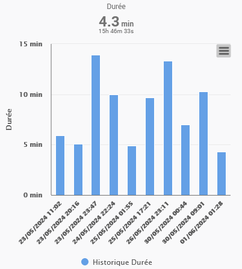

# lxrootard Jeedom v4 Widgets

## Image Viewer
Widget to display an image from an URL command
 

Get the [code](./dashboard/cmd.info.string.ImageViewer_lxr.html)

## Barchart
Widget to display a command's last history values as barchart (no timeline)
 

Parameters:

    #serie_title# : serie title
    #serie_name# : serie name
    #unite# : Y axis unit
    #max_days# : displays the last D days (default 30)
    #nb_values# : displays the N last values (default 10)
    #serie_color# : barchart color
    #hide_value# : hides the serie's last value displayed at the the top (default: no)

Get the [code](./dashboard/cmd.info.numeric.BarChart_lxr.html)

## Installation
Copy the html code in `/var/www/html/data/customTemplates/{type}` 
 Copy the pictures (if any) in  `/var/www/html/data/customTemplates/{type}/{widget_name}`
 Where `{type}` = dashboard or mobile and `{widget_name}` is the widget's html name 
